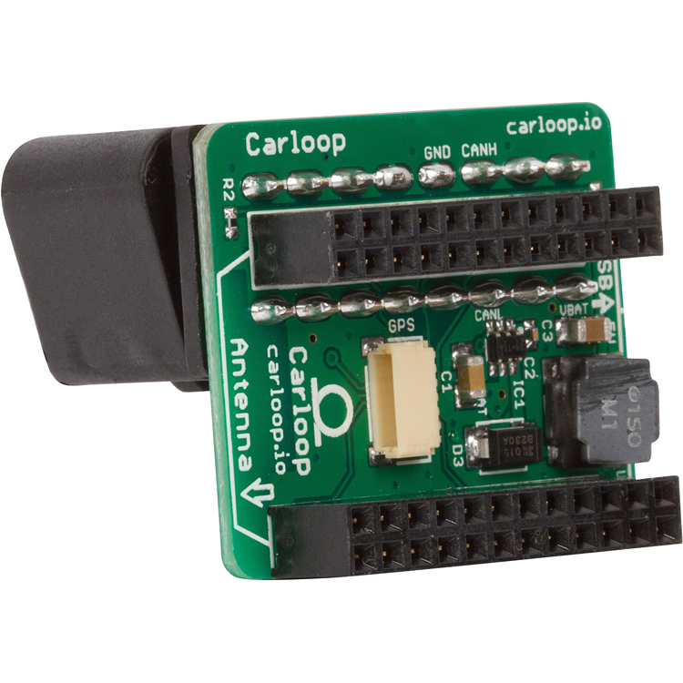
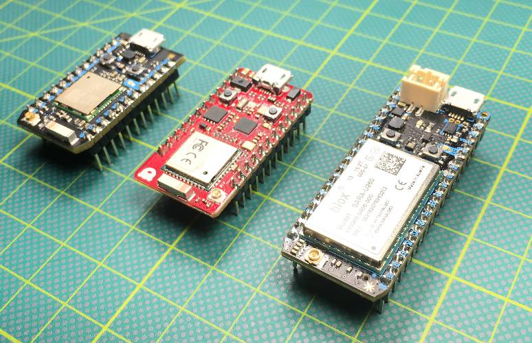
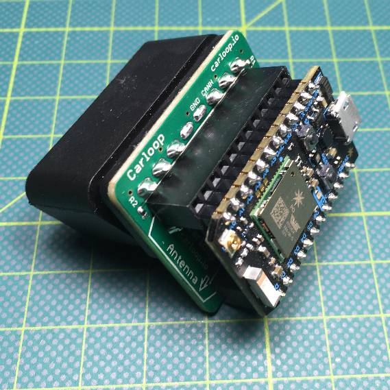
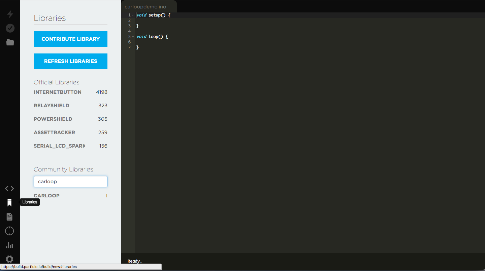
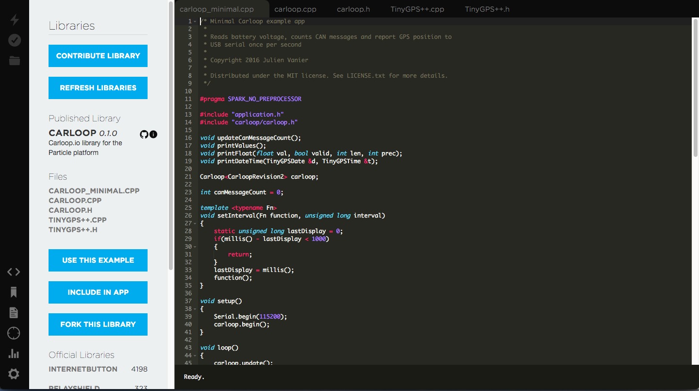
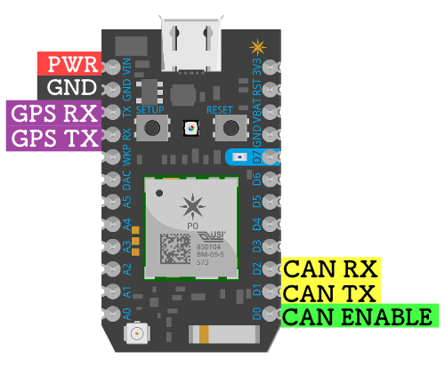

  

# What is Carloop?
Carloop is an open source development kit that lets you easily access a car's CAN bus.

Now that you have your Carloop, we understand you are anxious to connect it to your car and start developing some apps!

This page will walk you through how to get started and how to dig deeper into writing custom Carloop apps.

If you feel lost at any point, feel free to post in the Carloop community.

[Visit Carloop community >](https://community.carloop.io)

# Getting started with Carloop

To get started with Carloop, all you need is the following:

- [Carloop Basic](https://store.carloop.io/products/carloop-basic?utm_source=github&utm_campaign=docs)
- Computer with OSX/Windows/Linux to program and flash
- Micro-usb to USB cable

## The hardware pieces explained

### The Carloop board

The Carloop board connects to the OBD-II port in any car.

### The microcontroller

The brain of Carloop can be the Particle Photon (Wi-Fi microcontroller), the Particle
Electron (3G cellular microcontroller) or the Red Bear Duo (Bluetooth +
Wi-Fi microcontroller).

### Assembled Carloop

Plug in the microcontroller into the Carloop board. Make sure to put the USB port towards the right.
The Carloop Basic comes pre-assembled with a Particle Photon.

### Your car

The connector on Carloop is compatible with the OBD-II port found on all cars since 2008. Cars made between 1996 and 2008 also have an OBD-II port, but [there may not be a CAN bus on the OBD-II port on those cars](https://community.carloop.io/t/when-the-main-can-bus-is-not-on-the-obd-ii-port/116) so it won't work with Carloop.

## Get Ready to develop

You'll be using the tools from [Particle](https://www.particle.io) to
program the software in the Photon and Electron.

####1.	Set up a Particle account:

If you don't have a Particle account, take the time to
<a href="https://login.particle.io/signup" target="_blank">sign up for an account now</a>.

####2.	Connect your device to the Internet

You'll need to connect your Particle Photon or Particle Electron to the
Internet so you can program it.
The easiest way to do that is to connect the device to USB and follow the
steps on the [Particle setup page](https://setup.particle.io).

####3.	Get familiar with Particle

You'll be writing code for Carloop in the [Particle Web IDE](https://build.particle.io).
It's a good idea to go through a first Particle project if you have not
programmed a Particle device before.  The [Particle
documentation](https://docs.particle.io) has step-by-step examples.

## Your first Carloop project

Here's a project to make the blue LED on the Photon or Electron blink when receiving
data through the OBD port.

####	Step 1: Search Carloop Library
Search for the Carloop library by clicking on the Libraries button and typing `carloop`. Once you find it, click on it.

####	Step 2: Select the OBD Blink example
Click the `obd_blink.cpp` example then click USE THIS EXAMPLE.

####	Step 3: Flash the code
Click the lightning bolt icon to compile the code and flash it (transfer it to the memory of the Particle Photon or Electron).

####	Step 4: You're done!
If you plug the Carloop into the OBD port in your car and turn the key
on, you'll see the blue LED blink. This indicates that the Carloop is
receiving messages from the engine computer in the car!

Now you are ready to start programming your own app!

# Car talk

Before diving deeper, it's useful to introduce some vocabulary about cars.

**Controller Area Network (CAN)** The network used to connect computers in modern cars.

**CAN message** One piece of information exchanged between 2 computers on a CAN bus. It has an id number identifying what is in the message and up to 8 data bytes.

**On-board diagnostics (OBD-II)** The diagnostic protocol available in all cars. Since 2008 all US cars must have OBD-II through CAN so are compatible with Carloop.

**OBD-II port** The trapezoid shaped connector under the steering wheel where to plug Carloop. It has pins for the car battery and CAN.

**Firmware** Software for an embedded computer, stored in read-only memory.

**Flash** Program the read-only memory of an embedded computer with a new version of firmware. Can be done over the wire or over the air in case of Carloop.

**Electronic control unit (ECU)** A computer in the car, like the engine control unit, transmission control unit. Typically those communicate with each other over CAN.

**SocketCAN** Driver to interface with CAN hardware connected to a Linux computer.

**Can-utils** A rich set of utilities (candump, cangen, etc) to record, replay, analyze CAN traffic on Linux.

# Work in progress

## Carloop Pinout

Carloop aligns with the Particle Photon and Particle Electron so that the following pins are used:
Carloop's PCB connects your car's CAN bus network to the Photon, Electron and Duo. It also provides battery power and a GPS to track location.

	

## SocketCAN

## Advanced development

Install the [Particle CLI (Command Line Interface)](https://www.particle.io/cli) to be able to program your Carloop locally instead of over the air.

