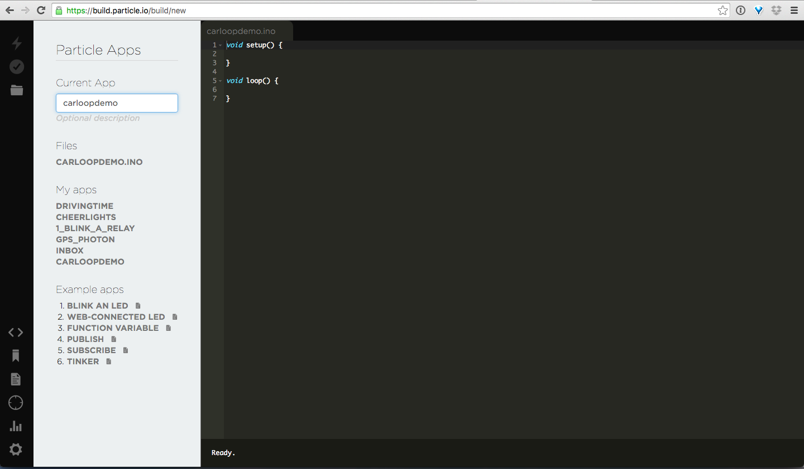

  

## What is Carloop?
Carloop is an open source development kit that lets you easily access a car's CAN bus.

## How do I get started?
To get started with Carloop, all you need is the following:
- Carloop Basic: [https://store.carloop.io/products/carloop-basic](https://goo.gl/QXREmq)
- OSX/Windows/Linux to program and flash
- Micro-usb to USB cable

### The Hardware Pieces Explained
Carloop Basic is a pre-built kit which comes with a Carloop [https://store.carloop.io/products/carloop](https://goo.gl/qSsLV8) plus a Particle Photon.  The Particle Photon is a microcontroller that comes with a CAN bus and a WiFi radio.  We've looked at many options out there and this was the easiest development kit we could find!

# SUGGEST EDITS
After you sign up to Particle's Web Development Environment, follow these four easy steps.

### Step 1: Create New App
Go to build.particle.io and click on Create New App, you'll see this:

##Step 2: Add Carloop Library
Add the Carloop library to your app by clicking on the Libraries button and search for the Carloop library. Once you find it, click on it.

# Step 3: Include in App
To include the Carloop library in your app, you have to manually click the INCLUDE IN APP button so the app you are building will now which library to use.

# Step 4: You're done!
Now you are ready to start programming your own app! Follow Hello World on the next page to learn how to blink and LED!

